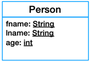
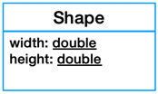

## [Lesson02](../readme.md) > Exercise03:

1. Open class [Main](../app/src/main/java/org/dii/oop/Main.java) in package `main.java.org.dii.oop` and edit the code to call Lesson.run() method from `exercise03`.


2. Create class [Person](../app/src/main/java/org/dii/oop/exercise03/Person.java) and [Shape](../app/src/main/java/org/dii/oop/exercise03/Shape.java) and place it in the package `main.java.org.dii.oop.exercise03` (You have to define all attributes as shown in the diagram):

     


3. Edit the method `displayPerson()` and `displayShape()` of class [Lesson](../app/src/main/java/org/dii/oop/exercise03/Lesson.java) in package `main.java.org.dii.oop.exercise03` to display the output as shown below:
```
Output:
Name:John Doe
Age:24

Output:
Width:100
Height:200
```
4. Edit the code to create different 5 persons and 5 Shape.
5. Call the method displayPersion and displayShape to show the information. 