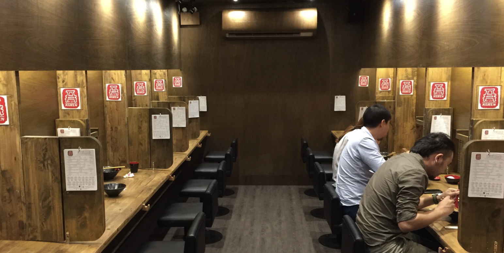
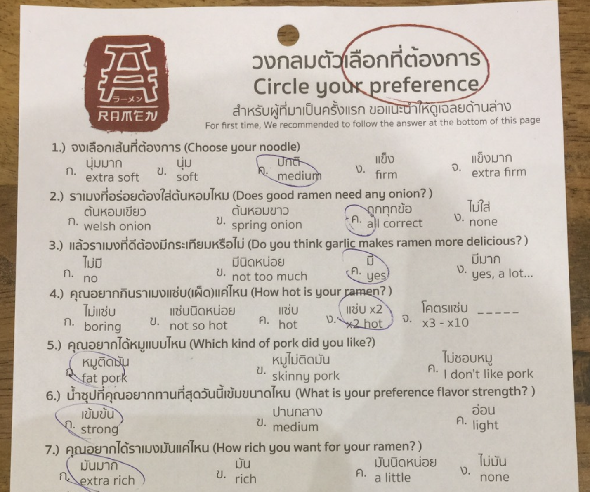

## [Lesson02](../readme.md) > Exercise05:

1. Open class [Main](../app/src/main/java/org/dii/oop/Main.java) in package `main.java.org.dii.oop` and edit the code to call Lesson.run() method from `exercise05`.

2. Edit class [Lesson](..//app/src/main/java/org/dii/oop/exercise05/Lesson.java) in package `main.java.org.dii.oop.exercise05` and follow the instructions below:

* Create a program to store the order of a ramen restaurant. 
The customers sit seperately and order  noodles by circling their preference similar to taking an exam.  

  

   

* The customer of this Ramen restaurant has the menu as shown below:

   

* Design and create a Noodle class for this restaurant.

* Test and create class instances of your designed class.
* The program must be able to accept multiple orders. 
* The program terminates when the user chooses to exit. 
     
